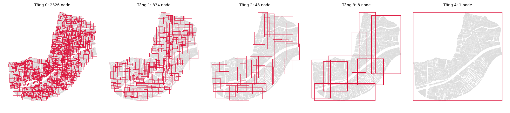
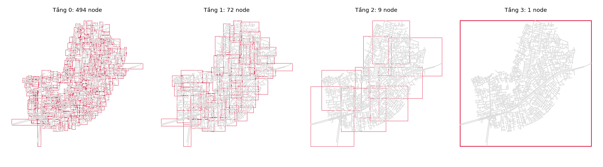

# R-tree (Guttman 1984)

## 1. Định nghĩa
  R-tree - Rectangle Tree là một cấu trúc dữ liệu dạng cây đa phân, tự cân bằng (*), được thiết kế để lập chỉ mục (indexing) không gian đa chiều (điểm, đường, đa giác). Mục tiêu là gom nhóm các đối tượng ở gần nhau vào bên trong các bounding box để tăng tốc độ tìm kiếm.

  R-tree là cấu trúc dynamic: Hỗ trợ insert và delete từng đối tượng mà không cần build lại.

  (*): Khái niệm tự cân bằng ở đây hiểu theo cấu trúc dữ liệu dạng cây trong Khoa học máy tính - **Xem thêm Mục: 3.5 Cây luôn tự cân bằng**

## 2. Cấu trúc dữ liệu
R-tree được tổ chức dạng cây phân cấp các "Hình chữ nhật nhỏ nhất bao quanh các đối tượng không gian - Minimum Bounding Rectangle - `MBR`". Trong đó:
 - Leaf Node (`L0`): Cấp nhỏ nhất, chứa các `MBR` của các đối tượng không gian thực tế và một con trỏ - Pointer chỉ trực tiếp đến dữ liệu đó trong cơ sở dữ liệu.
 - Internal/Non-leaf nodes (`L1 ... Ln`): Chứa các `MBR` lớn hơn. Mỗi `MBR` này bao trọn toàn bộ các `MBR` của các nút con (child nodes) bên dưới nó, kèm theo con trỏ trỏ đến nút con đó.
 - Root node: Cấp cao nhất, bao trùm toàn bộ không gian dữ liệu.

(*) Mỗi nút trong R-tree có sức chứa được quy định sẵn: Số lượng phần tử tối thiểu là m ; Số lượng phần tử tối đa là M

## 3. Thuật toán
### 3.1 Nguyên tắc chung
- Các đối tượng không gian nằm gần nhau nên nằm chung một node, để `MBR` của node nhỏ và ít chồng lấn với node khác. 
- Khi đó muốn truy vấn dữ liệu chỉ cần đi vào vài nhánh và bỏ qua phần còn lại.
### 3.2 Insert
Dữ liệu được thêm vào sẽ đi từ `Root` xuống `Leaf` theo hướng đỡ tốn cost nhất, Tức là:
  - Chọn nhánh mà `MBR` phải mở rộng ít nhất để chứa đối tượng mới.
  - Đối tượng được đặt vào `Leaf` đó. Nếu `Leaf` đầy quá `M` thì Split nó ra, và việc này có thể lan dần lên các `Node` cha.
### 3.3 Split
Cần chia `M + 1` entry từ `MBR` cũ thành 2 nhóm mới sao cho chúng nhỏ và ít chồng nhau. Theo Guttman (Quadratic):
- Xác định hai Entry xa nhau nhất. Chúng sẽ là cơ sở cho hai nhóm mới được sinh ra.
- Còn các Entry còn lại sẽ lần lượt gắn vào nhóm nào mà `MBR` của nhóm đó phải ít mở rộng hơn `MBR` khi gắn vào nhóm còn lại. Dấu hiệu dễ nhận biết là xem Entry gần nhóm nào hơn.
- Đảm bảo mỗi nhóm có ít nhất `m` entry.
### 3.4 Delete
Khi xoá 1 đối tượng ra khỏi `Leaf`:
  - Nếu một `Node` còn quá ít (< `m` - Số lượng tối thiểu) thì giải thể node đó.
  - Các con của nó được chèn lại vào `Root` (ở đúng level hiện tại của chúng). Cách này vừa giữ `Node` không quá thưa, vừa cho các entry cơ hội tìm được vị trí tốt hơn.
### 3.5 Cây luôn tự cân bằng
Trong CTDL dạng cây, khái niệm “cân bằng - balance” có nghĩa là các `Leaf Node` đều nằm ở cùng 1 độ sâu - Cách `Root` số lượng bước nhảy như nhau.
`R-tree` luôn duy trì được trạng thái cân bằng này (Giống như `B-tree`) nhờ nguyên lý cốt lõi:
> **Cây không bao giờ "dài ra" từ phía lá, mà nó chỉ "cao lên" từ phía gốc**.
### 3.5.1 Cơ chế lớn lên
Khi Insert 1 đối tượng không gian mới vào `R-tree`, đối tượng đó luôn luôn được đặt vào một `Leaf Node` hiện có (nơi có Bounding Box phù hợp nhất). Hệ thống sẽ xử lý theo các tình huống sau:
  - **Trường hợp lý tưởng**: `Leaf Node` đó vẫn còn chỗ trống (chưa vượt quá sức chứa tối đa `M`). Đối tượng được chèn vào bình thường. Cây không thay đổi chiều cao.
  - **Trường hợp `Node` bị đầy**: Nếu `Leaf Node` đã chứa đủ `M` phần tử và việc cố nhét thêm phần tử thứ `M+1`, `Node` đó buộc phải tách ra - **Node Splitting**. 
    - Bây giờ, từ 1 `Leaf Node` cũ, ta có 2 `Leaf Node` mới.
    - Hệ thống phải trigger sự thay đổi này lên `Parent Node` yêu cầu cập nhật lại Bounding Box để cover 2 `Leaf Node` mới
  - **Lan truyền ngược lên**: 
    - Nếu `Parent Node` vẫn còn chỗ trống: Nó nhận con trỏ mới, cập nhật lại Bounding Box. Quá trình dừng lại.
    - Nếu `Parent Node` cũng bị đầy: Nó lại tiếp tục bị tách làm 2, và lại trigger lên `Parent Node` của nó. Quá trình này có thể lan truyền hiệu ứng domino ngược lên trên.
  - **Tách gốc**: Nếu phản ứng dây chuyền lan truyền lên tận `Root` và `Root` cũng bị đầy, `Root` sẽ bị tách làm 2.
    - Hệ thống sẽ tạo 1 `Root` mới cover 2 `Node` gốc vừa bị tách.
    - **Kết quả**: Chiều cao của toàn bộ cây tăng lên đúng 1 `level`. Vì `Root` mới được thêm vào ở trên cùng, khoảng cách từ `Root` mới đến tất cả các `Leaf Node` bên dưới đều đồng loạt cộng thêm 1. **Cây vẫn cân bằng tuyệt đối**.

### 3.5.2 Cơ chế lùn lên
Khi Delete 1 đối tượng, `R-tree` phải đảm bảo không có `Node` nào bị "rỗng" hoặc chứa quá ít phần tử (phải duy trì mức tối thiểu `m` phần tử mỗi nút để cây không bị phân mảnh).
  - **Thiếu hụt**: Nếu xóa một đối tượng khiến `Leaf Node` bị tụt xuống dưới ngưỡng `m`, `Leaf Node` đó sẽ bị đánh dấu xóa bỏ hoàn toàn.
  - **Orphan & Re-insertion**: Các phần tử còn sót lại trong `Node` vừa bị xóa sẽ trở thành **Orphan**. Hệ thống sẽ lấy các phần tử này, chạy lại việc **Insert** từ `Root` (ở đúng level hiện tại của chúng).
  - **Thu gọn `Root`**: Nếu sau các quá trình **Delete** và **Insert**, `Root` chỉ còn duy nhất 1 `Node` con, `Root` cũ sẽ bị xóa bỏ. Nút `Node` duy nhất đó sẽ được "thăng cấp" lên làm `Root` mới.
  - **Kết quả**: Chiều cao của toàn bộ cây đồng loạt giảm đi 1 mức. Cây vẫn giữ nguyên trạng thái cân bằng.

## 4. Ưu nhược điểm
### 4.1 Ưu điểm
  - **Hỗ trợ dữ liệu động `dynamic`**: Đây là ưu điểm lớn nhất `R-tree`. Nó cho phép thực hiện các lệnh `INSERT`, `UPDATE`, `DELETE` liên tục mà không cần phải đập đi xây lại toàn bộ cấu trúc chỉ mục.
  - **Linh hoạt cho cơ sở dữ liệu**: `R-tree - hay GiST` là lựa chọn duy nhất khả thi cho các bảng dữ liệu hệ thống thông tin địa lý GIS thường xuyên cập nhật
### 4.2 Nhược điểm
  - **Dễ bị phân mảnh và chồng lấn (`Overlap`)**: 
    - Hình dáng và độ hiệu quả của cây phụ thuộc hoàn toàn vào thứ tự chèn dữ liệu. 
    - Nếu chèn ngẫu nhiên, các Bounding Box của nút cha sẽ phải phình to và đè lên nhau rất nhiều.
  - **Tốc độ truy vấn giảm dần theo thời gian**: Do sự chồng lấn tăng cao sau nhiều lần thêm/sửa/xóa, một truy vấn sẽ phải rẽ vào nhiều nhánh dư thừa hơn, làm chậm tốc độ tìm kiếm.
  - Tốn công bảo trì: Quản trị viên cơ sở dữ liệu định kỳ phải chạy lệnh dọn dẹp và sắp xếp lại chỉ mục (như `REINDEX` hoặc `VACUUM ANALYZE` trong `PostgreSQL`) để cây trở lại trạng thái tối ưu.

## 5. Kết quả build thực nghiệm

Dữ liệu: khu vực HBC (TP.HCM), sức chứa `M = 10`. Kết quả lưu tại `results/rtree/`.

| Layer | Số đối tượng | Build time (s) | Chiều cao | Số node theo level (L0 → Root) |
|---|---|---|---|---|
| full_parcels_HBC | 15,934 | 1.5782 | 5 | 2326 / 334 / 48 / 8 / 1 |
| full_roads_hbc | 3,451 | 0.2933 | 4 | 494 / 72 / 9 / 1 |

### Trực quan hoá các level

Mỗi khung là `MBR` của các node ở từng level của cây.

**Parcel (`full_parcels_HBC`)**

**Road (`full_roads_hbc`)**

