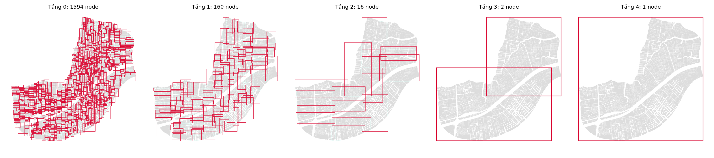
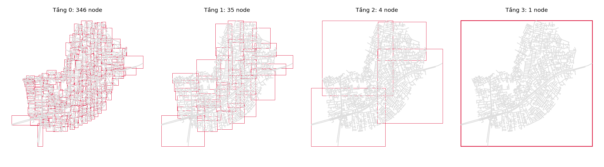

# STRtree - Sort-Tile-Recursive Packed R-tree (Scott Leutenegger 1997)

## 1. Định nghĩa

`STRtree` không phải là một cấu trúc dữ liệu hoàn toàn mới, mà bản chất là một cây `R-tree` **tĩnh** được tạo ra bằng thuật toán nạp hàng loạt (`Bulk-loading`) do Scott Leutenegger và các cộng sự giới thiệu (1997).

Mục tiêu của `STRtree` là đóng gói (`pack`) các đối tượng không gian vào các Bounding Box sao cho độ chồng lấn (`overlap`) được triệt tiêu và chiều cao của cây là thấp nhất.

`STRtree` là cấu trúc tĩnh (`static`): Chỉ phát huy sức mạnh khi đã có sẵn toàn bộ tập dữ liệu đầu vào (ví dụ: tập dữ liệu `read-only`, xử lý trong bộ nhớ `RAM`). Nó không hỗ trợ tốt việc chèn hoặc xóa từng đối tượng sau khi cây đã được xây dựng.

## 2. Cấu trúc dữ liệu
`STRtree` vẫn sử dụng kiến trúc phân cấp các `MBR` y hệt như `R-tree` với `Leaf Node` chứa dữ liệu thực và `Internal Node` chứa các `MBR` bao trùm. Trong đó:
   - Leaf Node (`L0`): Cấp nhỏ nhất, chứa các `MBR` của các đối tượng không gian thực tế và một con trỏ - Pointer chỉ trực tiếp đến dữ liệu đó trong cơ sở dữ liệu.
   - Internal/Non-leaf nodes (`L1 ... Ln`): Chứa các `MBR` lớn hơn. Mỗi `MBR` này bao trọn toàn bộ các `MBR` của các nút con (child nodes) bên dưới nó, kèm theo con trỏ trỏ đến nút con đó.
   - Root node: Cấp cao nhất, bao trùm toàn bộ không gian dữ liệu.

Sự khác biệt cốt lõi nằm ở đặc tính vật lý của các `Node`:
- **Packed**: Mọi `Node` trong `STRtree` đều được lấp đầy đạt công suất tối đa `M` (Capacity = 100%), ngoại trừ các `Node` nằm ở rìa cuối cùng của lưới. Không có khoảng trống lãng phí.
- **Zero Overlap**: Các nhánh hoặc `Node` ở cùng một `level` gần như không đè lên nhau, nhờ không gian được chia lưới toán học nghiêm ngặt ngay từ đầu.
- **Chiều cao tối thiểu**: Với lượng phần tử $N$ và sức chứa $M$ cố định, thuật toán đảm bảo sinh ra một cây có chiều cao nông nhất có thể về mặt lý thuyết.

## 3. Thuật toán

### 3.1 Nguyên tắc chung
Thay vì chèn từng đối tượng từ trên xuống (top-down incremental) như `R-tree`, `STRtree` thực hiện bao quátbhown. Nó lấy toàn bộ dữ liệu đầu vào, trải dài ra, sắp xếp, cắt thành các lưới, đóng gói vào các `Leaf Node` rồi mới xây ngược lên `Root`.

### 3.2 Sort
- Trích xuất tọa độ trung tâm (Center point) của `MBR` của toàn bộ $N$ đối tượng không gian.
- Sắp xếp toàn bộ $N$ đối tượng này theo một trục tọa độ (thường là trục hoành - Trục X).

### 3.3 Tile
Dựa vào giới hạn phần tử tối đa M của mỗi Node, hệ thống tính toán số lượng Leaf Node tổng cộng cần thiết: $P = \lceil N/M \rceil$.
- Thuật toán tiếp tục chia tập dữ liệu đã sắp xếp thành các dải dọc (Vertical Slices / Tiles).
- Số lượng dải dọc được tính bằng công thức: $S = \lceil \sqrt{P} \rceil$.
- Lúc này, mỗi dải dọc sẽ chứa một số lượng đối tượng xấp xỉ bằng $S \times M$.
### 3.4 Recursive
- Bên trong mỗi dải dọc vừa được chia, dữ liệu lại tiếp tục được đem ra sắp xếp theo trục tung (Trục Y).
- Sau khi sắp xếp xong theo trục Y, hệ thống cứ tuần tự gom đúng M đối tượng nằm cạnh nhau đóng gói chặt vào 1 `Leaf Node`.
- **Đệ quy**: Sau khi toàn bộ các `Leaf Node` (ở tầng $L_0$) được tạo xong, hệ thống coi mỗi `Leaf Node` này như một "đối tượng không gian mới". Quá trình **Sort - Tile - Recursive** lại được lặp lại từ đầu để gom chúng thành các Node ở tầng $L_1$, rồi $L_2$, v.v.
Quá trình đệ quy ngược lên trên (bottom-up) dừng lại khi tất cả hội tụ về duy nhất một `Node` trên cùng — đó chính là `Root`.

### 3.5 Insert & Delete
Thuật toán STR sinh ra không dành cho việc cập nhật.
   - Không có cơ chế Node Splitting (tách nút) hay Re-insertion (nạp lại) phức tạp.
   - Khi có một dữ liệu mới cần `Insert` hoặc `Delete`, hệ thống thông thường sẽ xóa bỏ toàn bộ cây `STRtree` cũ trong bộ nhớ và chạy lại thuật toán `STR` để build một cây mới. Vì `STR` chỉ đơn thuần là mảng sắp xếp (Sorting), tốc độ đập đi xây lại của nó cực kỳ nhanh.

## 4. Ưu nhược điểm
### 4.1 Ưu điểm
- **Tốc độ truy vấn tối ưu**: Tình trạng `Overlap` cực thấp và cây rất nông giúp engine tìm kiếm đi thẳng tắp tới kết quả, không bị lãng phí chi phí `I/O` để duyệt các nhánh sai (dương tính giả) như `R-tree`.
- **Tiết kiệm Memory / Cache**: Việc đóng gói 100% giúp các `Node` liền mạch, tiết kiệm `RAM`. Phù hợp để các thư viện không gian (`GEOS`, `Shapely`, `JTS`) dùng làm chỉ mục tạm thời trong bộ nhớ (`In-memory index`).
- **Tốc độ Build ban đầu nhanh**: Việc sắp xếp và chia lưới 1 triệu phần tử bằng mảng một lần duy nhất tốn ít tài nguyên tính toán hơn rất nhiều so với việc gọi lệnh Insert 1 triệu lần vào R-tree động.

### 4.2 Nhược điểm
- **Static**: Đây là nhược điểm chí mạng. Hệ thống gần như bị "đóng băng" sau khi tạo. Không thể áp dụng cho các luồng dữ liệu thời gian thực (Real-time tracking).
- **Không phù hợp làm Index trực tiếp cho CSDL Transactional**: Không thể gán `STRtree` trực tiếp cho một bảng có người dùng liên tục thực hiện các lệnh `DML` `(INSERT/UPDATE/DELETE)`. Cấu trúc này thường chỉ chạy ngầm phía sau hoặc áp dụng cho các kho dữ liệu (`Data Warehouse`) tĩnh.

## 5. Kết quả build thực nghiệm

Dữ liệu: khu vực HBC (TP.HCM), sức chứa `M = 10`. Kết quả lưu tại `results/stree/`.

| Layer | Số đối tượng | Build time (s) | Chiều cao | Số node theo level (L0 → Root) |
|---|---|---|---|---|
| full_parcels_HBC | 15,934 | 0.0301 | 5 | 1594 / 160 / 16 / 2 / 1 |
| full_roads_hbc | 3,451 | 0.0065 | 4 | 346 / 35 / 4 / 1 |

### Trực quan hoá các level

Mỗi khung là `MBR` của các node ở từng level của cây.

**Parcel (`full_parcels_HBC`)**

**Road (`full_roads_hbc`)**

